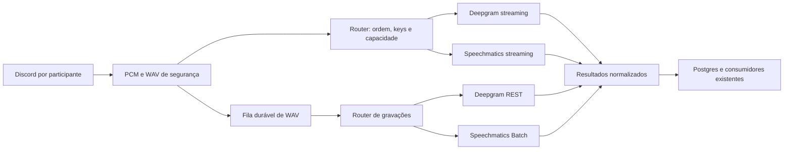

# Plano: Deepgram e Speechmatics com preferência e fallback

Data: 2026-10-03. Estado: implementação disponível; validação com simuladores locais e PostgreSQL.
Ensaio de qualidade PT-PT e credenciais reais permanecem por realizar.

## Resultado pretendido

Adicionar Deepgram ao bot com várias API keys, transcrição em streaming e de ficheiros
WAV. Permitir escolher a ordem dos fornecedores, inicialmente
`deepgram,speechmatics`, e fazer fallback nos dois sentidos. `/keys` apresenta
informação de ambos, mesmo quando um deles é apenas o fornecedor de reserva.

A implementação é viável com a arquitetura existente: o Go já captura áudio por
participante, guarda WAV de segurança e envia PCM para a API Python; a API já tem
reservas, filas duráveis, gerações e substituição de resultados de streaming por Batch.
O trabalho principal é generalizar as decisões hoje específicas de Speechmatics e
adicionar dois adaptadores Deepgram. A precisão em PT-PT terá de ser medida com áudio
real; a integração, por si só, não demonstra melhoria de reconhecimento.

## 1. Limites confirmados do Deepgram

Consulta à documentação oficial em 2026-10-03:

| Plano / região | Nova-3 streaming | Nova-3 gravações em simultâneo |
| --- | ---: | ---: |
| Pay As You Go, incluindo endpoint europeu | Até 150 | Até 50 |
| Growth, América do Norte | Até 225 | Até 50 |
| Growth, Europa | Até 150 | Até 50 |

Os limites são **por projeto, não por API key**. Duas keys do mesmo projeto
partilham a capacidade; criar keys adicionais não aumenta o número de streams.
Projetos secundários de contas self-service têm restrição a um stream. A documentação
também proíbe distribuir tráfego por contas/projetos para contornar limites.
Estes valores são limites documentados, não uma verificação das quotas de uma conta
concreta. [Fonte: API Rate Limits](https://developers.deepgram.com/reference/api-rate-limits).

Decisão de implementação: controlar capacidade por grupo de quota/projeto, com
contadores separados para streaming e gravações. Não copiar a regra Speechmatics
de duas vagas por key para Deepgram. Keys repetidas são deduplicadas. Um `429` bloqueia
temporariamente novas admissões no grupo afetado; rodar para outra key desse grupo
não resolve falta de capacidade.

O bot já identifica quem fala através do Discord. Não ativar diarização remota:
não é necessária para este percurso e tem limites próprios.

## 2. Base existente e alterações necessárias

| Área | Estado observado | Alteração prevista |
| --- | --- | --- |
| `discord_bot/audio_convert.go` | Opus → PCM 48 kHz estéreo; WAV por utilizador; recuperação RTP | Reutilizar captura e definir rotação imediata de WAV quando muda a atribuição |
| `discord_bot/streaming.go` | PCM mono, WebSocket interno, reservas e eventos do assistente | Acrescentar fornecedor às atribuições e gerir transições sem reenviar áudio antigo ao assistente |
| `app/realtime.py` | Pool com duas vagas por key; protocolo Speechmatics dentro do bridge | Admissão por grupo e adaptação dos protocolos por fornecedor |
| `app/streaming_routes.py` | Streaming exige `transcription_provider == speechmatics` | Avaliar a ordem efetiva e capacidades de todos os fornecedores elegíveis |
| `app/transcriber.py` e `app/main.py` | Whisper/Speechmatics; recuperação de job Speechmatics com sidecar | Router de gravações com fallback e adaptador Deepgram |
| `app/speechmatics_errors.py` | Estado de keys e erros específico de Speechmatics | Separar erro normalizado de parsing de cada fornecedor |
| `src/data/repository.py` | Gerações, finais idempotentes, troca Batch/Realtime, consumo Realtime | Persistir preferência, origem dos resultados e tentativas por fornecedor |
| `discord_bot/main.go` e `transcription_client.go` | `/keys` consulta exclusivamente Speechmatics | Endpoint agregado e apresentação por fornecedor/projeto/key |
| `discord_bot/speechmatics_usage_alerts.go` | Alertas dependem do fornecedor selecionado | Continuar a acompanhar Speechmatics quando é fallback, sem duplicar uso partilhado |

As referências `app/...` correspondem a `src/transcription-api/app/...`.
Há alterações locais em `.env.example`, README, Compose e ficheiros do assistente;
reler o estado antes da implementação e integrar sem substituir esse trabalho.

## 3. Configuração e seleção da ordem

```dotenv
# Novas instalações: ordem comum a streaming e gravações.
TRANSCRIPTION_PROVIDER_ORDER=deepgram,speechmatics

# Manter compatibilidade com deployments antigos que só definem esta variável.
TRANSCRIPTION_PROVIDER=speechmatics
TRANSCRIPTION_STREAMING_ENABLED=false

DEEPGRAM_API_KEY=
DEEPGRAM_API_KEY_01=
DEEPGRAM_API_KEY_02=

DEEPGRAM_API_BASE_URL=https://api.deepgram.com/v1
DEEPGRAM_REALTIME_URL=wss://api.deepgram.com/v1/listen
DEEPGRAM_MODEL=nova-3
DEEPGRAM_LANGUAGE=pt-PT
DEEPGRAM_KEYTERMS=
DEEPGRAM_ENDPOINTING_MS=500

# Opcional para consultar gestão/uso/saldo e identificar o grupo de quota.
DEEPGRAM_PROJECT_ID=
# Override opcional para uma key com associação diferente.
DEEPGRAM_PROJECT_ID_02=

# Limites locais de admissão para o grupo principal; ajustar à quota real.
DEEPGRAM_STREAMING_LIMIT=150
DEEPGRAM_BATCH_LIMIT=50
# Overrides por projeto/grupo, usando o mesmo sufixo da associação.
DEEPGRAM_STREAMING_LIMIT_02=1
DEEPGRAM_BATCH_LIMIT_02=1
```

Regras:

1. Preferência persistida por guild ganha ao ambiente. Na sua ausência, usar
   `TRANSCRIPTION_PROVIDER_ORDER`; se não estiver definida, usar apenas o
   `TRANSCRIPTION_PROVIDER` antigo. Não ativar fornecedores novos silenciosamente
   num deployment antigo. O exemplo novo recomenda Deepgram primeiro.
2. Aceitar as ordens `deepgram,speechmatics`, `speechmatics,deepgram` e seleção
   individual de um dos dois. Normalizar espaços/capitalização e rejeitar duplicados
   ou fornecedores desconhecidos. Whisper continua disponível pelo modo antigo;
   fallback automático para Whisper fica fora deste plano.
3. Fornecedores sem keys ficam visíveis como não configurados e são ignorados pelo
   router. Uma ordem sem nenhum fornecedor configurado devolve erro antes de a guardar.
4. Enumerar `DEEPGRAM_API_KEY` e `DEEPGRAM_API_KEY_*` com ordenação determinística,
   como já acontece com Speechmatics. Guardar segredos exclusivamente na API Python.
5. Keys sem associação explícita partilham um único grupo Deepgram, incluindo quando
   não há `PROJECT_ID`. API key basta para transcrever; ID do projeto é opcional para
   gestão. `/keys` mostra associação não verificada quando aplicável.
6. Associação explícita e metadata de gestão devem ser reconciliadas quando as
   permissões permitem. Se várias keys apontam para o mesmo projeto, juntar os seus
   contadores e usar o menor limite configurado em caso de conflito. Nunca somar
   limites por key nem assumir capacidade extra de projetos secundários. Identidades
   desconhecidas não geram capacidade adicional: até confirmar a associação real,
   aplicar também um teto conservador agregado ao conjunto Deepgram. Overrides de
   limite são tetos locais, não uma declaração de quota concedida pelo fornecedor.
7. Para Speechmatics, preservar a regra operacional atual de duas reservas por key
   distinta e a premissa anterior de contas distintas, claramente identificada como
   configuração local. Recusas reais do fornecedor prevalecem sobre essa premissa.
8. Endpoints REST/WS devem ter região consistente. Não somar capacidade ao trocar
   endpoint. Não usar gestão de keys nem criação de projetos automática.

## 4. Comandos e endpoints

Adicionar `/stt` com subcomandos:

```text
/stt status
/stt order providers:deepgram,speechmatics
/stt order providers:speechmatics,deepgram
```

`providers` usa escolhas Discord, incluindo cada fornecedor sozinho. A alteração
exige a mesma permissão de gestão do servidor usada por `/streaming`, é persistida
antes da confirmação e funciona sem reinício. `status` informa ordem efetiva,
origem da preferência, configuração, fornecedores em uso e modo streaming.
Resposta de configuração efémera; nomes e descrições em PT/EN segundo o padrão atual.

Novos endpoints internos:

- `GET /v1/guilds/{guild_id}/transcription`: ordem efetiva e origem.
- `POST /v1/guilds/{guild_id}/transcription`: validação/persistência da ordem.
- `GET /v1/transcription/keys?guild_id=...`: estado agregado por fornecedor.

Reutilizar os endpoints de streaming, incluindo `/v1/streaming/audio`.
Preservar `/v1/speechmatics/keys` e o cliente antigo durante a transição, mas retirar
o bloqueio que esconde Speechmatics quando outro fornecedor é o primeiro.

A nova ordem aplica-se às próximas admissões e aos próximos limites de WAV.
Não interromper uma ligação saudável no meio de uma frase para mudar preferência.
Quando uma mudança manual exige migrar um stream, fechar/flush a unidade atual e
abrir a próxima com a nova ordem. Uma recuperação já em execução conserva a decisão
e identificação da tentativa, evitando reinterpretar um job remoto como outro fornecedor.

## 5. Arquitetura mínima



Usar `httpx` e `websockets`, já instalados. Não é necessário acrescentar o SDK
Deepgram, serviço de filas ou coordenador externo. Introduzir um router pequeno para
os dois fornecedores e um contrato Realtime para abrir/enviar/fechar/normalizar.
Manter `TranscriptionResult`/`TranscriptionSegment` como resultado de gravações.

A autoridade sobre keys e capacidade continua na API, num único processo. Contadores
de REST partilhados entre workers e reservas WS devem usar sincronização segura entre
threads/event loop; não fazer I/O de rede sob o lock. Reservas contam mesmo antes de
abrir a ligação e são libertadas uma única vez, incluindo cancelamento e falha de handshake.
Vários processos/réplicas exigiriam coordenação partilhada e ficam fora do âmbito.

## 6. Adaptadores Deepgram

### Streaming

Usar Nova-3 com `language=pt-PT`, áudio `linear16`, 48 kHz e um canal; autenticação
por `Authorization: Token ...`. O Go já faz a conversão estéreo → mono antes do
WebSocket interno. Pedir parciais e pontuação. Normalizar `Results`: `is_final`
determina persistência; `speech_final` indica fim de fala, não substitui essa regra.
Mapear palavras e tempos para o evento `final` já consumido pelo assistente.
[Protocolo oficial](https://developers.deepgram.com/reference/speech-to-text/listen-streaming).

Não esperar `RecognitionStarted` do Deepgram: o adaptador confirma o handshake WS
antes de devolver `ready`. Preservar sequências internas, limites de buffers, silêncio
DTX, offsets e validação de tempos em relação às amostras enviadas.

Durante espera sem envio de áudio, emitir `KeepAlive` textual com intervalo de cinco
segundos. Não confundir heartbeat com amostras de áudio nem retirar silêncio do
percurso existente sem atualizar o mapa temporal.
[KeepAlive](https://developers.deepgram.com/docs/audio-keep-alive).

No fecho normal da unidade, `CloseStream` solicita processamento do áudio restante;
consumir os finais e metadata de fecho antes de confirmar conclusão, com timeout
limitado. Se o fecho for incompleto, recuperar pelo WAV. `Finalize` é uma operação
de flush e não é uma confirmação genérica de sucesso de todo o stream.
[CloseStream](https://developers.deepgram.com/docs/close-stream),
[Finalize](https://developers.deepgram.com/docs/finalize).

### Gravações WAV

Enviar o ficheiro local a `POST /v1/listen` com Nova-3, `pt-PT`, pontuação e
`utterances=true`. Converter os intervalos devolvidos para segmentos e usar palavras
como alternativa de segmentação quando necessário. Validar resultados vazios,
tempos e duração; silêncio legítimo pode produzir resultado vazio com sucesso.
[API de gravações](https://developers.deepgram.com/reference/speech-to-text/listen-pre-recorded).

Derivar um WAV mono temporário a partir do WAV de segurança estéreo, preservando
número de frames e duração; enviar o seu conteúdo com `Content-Type: audio/wav`.
Manter o original para recuperação e limpar o derivado após a tentativa.
Não configurar diarização/multichannel por participante. Não carregar a gravação
inteira em memória; enviar em chunks com timeout e limites já existentes.

Começar com REST síncrono nos workers existentes. Persistir o `request_id` e o
resultado recebido antes da escrita final na DB, através de sidecar escrito
atomicamente e sem segredos. Após reinício, reutilizar esse resultado quando presente.
Se a resposta se perder depois do envio, pode ser necessário repetir a transcrição,
com custo repetido: idempotência local não garante faturação exatamente uma vez.
Não tratar `request_id` como um job Speechmatics consultável.
Estender a limpeza normal, recuperação e `/forget` aos novos WAV derivados e sidecars;
estes contêm áudio/texto e devem ter o mesmo ciclo de vida da unidade original.

`DEEPGRAM_KEYTERMS` deve aplicar-se aos dois modos, codificado como parâmetros
`keyterm` repetidos. Para Nova-3 usar `keyterm`, não o parâmetro legado `keywords`.
[Keyterm Prompting](https://developers.deepgram.com/docs/keyterm).

## 7. Preferência, fallback e recuperação

### Seleção

Percorrer fornecedores pela ordem efetiva. Dentro de cada um, escolher uma key
saudável, respeitando o limite do grupo, com menor ocupação e desempate determinístico.
Não depender de sucesso da consulta de saldo para admitir transcrição.

Para a ordem `deepgram,speechmatics`, tentar keys elegíveis Deepgram e depois
Speechmatics; com a ordem inversa, fazer o inverso. Tentativas são limitadas por
unidade/episódio: guardar os candidatos já tentados e nunca circular infinitamente
entre os mesmos fornecedores.

Fallback resolve falhas de serviço, credenciais, créditos ou capacidade. Uma resposta
com palavras incorretas pode ser tecnicamente bem-sucedida; não há deteção automática
fiável disso nesta versão. A preferência deve ser escolhida pelo ensaio de qualidade,
sem enviar todas as falas simultaneamente aos dois fornecedores.

### Erros e âmbito

| Situação | Ação |
| --- | --- |
| Key inválida/sem permissão de transcrever | Desativar essa key para o modo afetado; tentar outra e depois outro fornecedor |
| Gestão/uso/saldo sem permissão | Mostrar informação indisponível; não desativar a transcrição |
| `402`/falta de créditos confirmada | Marcar o grupo de faturação afetado; tentar outro grupo legitimamente configurado ou fornecedor |
| `429`/capacidade | Cooldown do grupo/produto; tentar outro fornecedor; não rodar keys do mesmo grupo para contornar o limite |
| Timeout, rede, `5xx`, fecho anormal | Retry limitado e cooldown; outro fornecedor; conservar WAV |
| Ficheiro PCM/WAV inválido ou contrato interno inválido | Falhar a unidade e diagnosticar; não tentar a mesma entrada inválida indiscriminadamente |
| Sem vagas em nenhum streaming | Continuar WAV/Batch; fila FIFO para futura promoção |

Deepgram documenta erros de autenticação/permissões, `402` por créditos e `429` por
limites. Interpretar códigos estruturados e o produto/operação, sem classificar
genericamente qualquer `401`/`403` de gestão como key inválida para STT.
[Errors](https://developers.deepgram.com/docs/errors).

Estado mínimo: key, grupo e fornecedor podem estar saudáveis, sem configuração,
inválidos, sem créditos ou em cooldown. Não confundir orçamento local, indisponibilidade
temporária e saldo. Cooldown recupera automaticamente com tentativa controlada;
esgotamento/invalidade requer alteração de credenciais ou revalidação explícita.

### Falha de streaming durante fala

1. Falha de abertura: tentar o próximo candidato antes de emitir `ready`, dentro do
   orçamento de handshake do cliente Go (atualmente 15 s). Ajustar cliente/API juntos
   se o orçamento for insuficiente; nunca manter o Go à espera indefinidamente.
2. Falha após enviar áudio: fechar o dono da unidade, invalidar a sua geração e
   conservar o WAV. O áudio dessa unidade segue recuperação por gravação.
3. O Go roda imediatamente o WAV num limite explícito, sincroniza a atribuição e
   abre uma nova unidade com outro fornecedor disponível. Se nenhum stream estiver
   disponível, grava até poder promover. Não esperar até ao fim da chamada para reagir.
4. O router Batch recebe o motivo e fornecedor falhado para evitar tentar logo o
   candidato em cooldown. Segue a ordem entre candidatos elegíveis; a recuperação
   não altera retroativamente a preferência persistida.
5. Resultados de recuperação substituem os finais anteriores da mesma unidade numa
   transação, usando o mecanismo existente. Eventos tardios da geração antiga são
   ignorados. A recuperação não é publicada ao canal de eventos do assistente.
6. Finais já entregues ao assistente não são executados novamente depois da troca.
   Invalidar contexto em curso quando perde a unidade, preservar proteção por
   identidade/geração e verificar o comportamento do assistente na transição.

Quando o fornecedor preferido recupera, usá-lo nas novas admissões. Streams saudáveis
no fallback conservam o seu titular até a próxima rotação normal; não migrar a meio
de fala nem retirar vaga de outro participante. Preservar FIFO, saída de participantes,
mudanças de canal e a regra atual de uma chamada ativa.

### Falha de todos os fornecedores

Só aplicar o descarte atual por créditos quando **todos os fornecedores remotos
configurados e permitidos pela ordem** tiverem confirmado falta de créditos e não
existir tentativa remota pendente capaz de concluir. Uma key inválida ou timeout não
constitui confirmação de créditos esgotados.

Se falta de créditos num fornecedor coexistir com falha temporária no outro, conservar
áudio para retry durável. Se não existir qualquer credencial utilizável por configuração
ou autenticação, suspender nova captura para transcrição e explicar a situação, sem
atribuir a créditos nem apagar automaticamente o pendente por esse motivo.

Generalizar o aviso atual de créditos para os fornecedores afetados; manter a limpeza
pendente recuperável, a preservação de texto concluído e as regras de `/forget`.
Não emitir avisos automáticos no Discord por cada mudança de fornecedor: estado de
fallback aparece nos comandos e logs. O aviso terminal segue a política já existente.

## 8. Persistência e contabilidade

Adicionar migração aditiva, previsivelmente `009_transcription_providers.sql`
(confirmar numeração na implementação; o projeto tem migrações até `008`).

- `guild_transcription_settings.provider_order`: array anulável; `NULL` usa ambiente.
- Metadados de unidade: fornecedor escolhido, modelo e grupo; origem do resultado
  final e motivo de recuperação. Reutilizar identidade WAV e `generation`.
- `voice_transcription_attempts`: tentativa por unidade, geração, produto
  (`streaming`/`batch`), fornecedor, key por nome, grupo, modelo, estado, duração
  enviada, timestamps, erro normalizado e identificador remoto quando disponível.

Esta tabela permite atribuir consumo a ambos os fornecedores quando a mesma unidade
passa por streaming e recuperação. Usar checkpoints monotónicos; não somar sucessivos
checkpoints da mesma tentativa. Não guardar segredos nem transcrições nesta tabela.

Preservar recuperação de `provider_job_id`/sidecars Speechmatics com o fornecedor
e key originais, mesmo depois de mudar a ordem. Antes de submeter a outro fornecedor,
consultar o job existente; se a recuperação remota falhar e houver fallback, persistir
a nova geração/dono e rejeitar resultados tardios. Não misturar IDs dos dois sistemas.

Manter leitura dos sidecars antigos. Inferir origem histórica apenas com evidência
(por exemplo, `realtime_key_name` Speechmatics ou sidecar/job conhecido); deixar dados
ambíguos como desconhecidos. Não atribuir gravações Whisper antigas a Speechmatics.
Separar contabilidade histórica já existente dos novos registos para evitar dupla soma.

## 9. `/keys`, `/streaming status` e `/health`

`/keys` apresenta primeiro a ordem efetiva e depois ambos os fornecedores:

- Configurado, preferência, modelos e disponibilidade de streaming/gravações.
- Por key: nome de configuração, estado, ocupação local e último erro normalizado.
- Por grupo/projeto: ocupação partilhada, limite local, quota documentada ou
  associação não verificada; não repetir o saldo como se pertencesse a cada key.
- Consumo local do bot separado por streaming/gravações, consumo reportado pelo
  fornecedor, período UTC e atualização da consulta.
- Saldo reportado Deepgram quando acessível; custos estimados com tarifa, data e
  fonte. Valores desconhecidos são `null`/indisponível, nunca zero.
- Speechmatics mantém a distinção atual entre consumo Batch remoto, Realtime local,
  custo estimado e saldo não disponível. Dados de keys partilhadas não são somados.

Deepgram tem APIs de consulta de [saldo por projeto](https://developers.deepgram.com/reference/manage/billing/list)
e [uso por projeto](https://developers.deepgram.com/reference/manage/usage/get).
Consultar uma vez por projeto com credencial autorizada; cache curta e timeout por
fornecedor. Se faltar permissão/ID, mostrar contabilidade local e a limitação. Usar
filtros por key apenas quando o endpoint utilizado os suportar; não atribuir consumo
global do projeto a cada key. Uma falha de consulta Deepgram não esconde Speechmatics.

Exemplo meramente ilustrativo, sem valores reais:

```text
Ordem: 1. Deepgram → 2. Speechmatics

Deepgram · nova-3 · pt-PT
Projeto principal: 4/150 reservas locais de streaming · saldo $180,00 reportado
01: disponível · 3 streams · uso local 2h 10m
02: disponível · 1 stream · uso local 0h 45m · partilha quota/saldo com 01

Speechmatics · streaming enhanced / Batch melia-1
01: disponível · 0/2 reservas locais · custo estimado $0,30
02: sem créditos confirmados · 0/2 reservas locais
Saldo Speechmatics: indisponível
```

Os contadores são do bot; não fingir conhecer ocupação de outros clientes do mesmo
projeto. O saldo não garante que uma conta não possa continuar em regime de pagamento.
O estado de crédito usado no router vem da resposta de inferência, não apenas do saldo.

Respostas com muitas keys devem ser divididas respeitando os limites Discord e usar
defer da interação enquanto consulta a API. Não exibir segredos, headers, tokens de
reserva ou mensagens cruas do fornecedor. `/streaming status` discrimina reservas
por fornecedor e fila; `/health` mostra ordem e fornecedores efetivamente utilizados.

## 10. Fases de implementação

1. **Configuração e estado comum:** parser de ordem/keys, grupos, erros, seleção e
   migração aditiva. Preservar modo antigo e recuperação de jobs existentes.
2. **Deepgram WAV:** adaptador REST, normalização, resultado durável, router Batch e
   fallback nos dois sentidos. Reutilizar workers e substituição transacional.
3. **Deepgram streaming:** adaptador WS, pool por grupo, finalização, normalização
   de eventos/tempos e passagem imediata para novo WAV/fornecedor após falha.
4. **Comandos e observabilidade:** `/stt`, `/keys` agregado, status/health, alertas
   e avisos de créditos generalizados; atualização de cliente Go e PT/EN.
5. **Configuração operacional:** `.env.example`, Compose e READMEs. Ensaiar ambos os
   modos e falhas controladas antes de recomendar Deepgram em produção.

Não instalar dependências novas por defeito. Não alterar captura, resumos, perfis,
TTS ou lógica musical além dos pontos necessários ao novo router/eventos.

## 11. Validação e critérios de aceitação

Testes focados, aproveitando as suites existentes:

| Cenário | Evidência exigida |
| --- | --- |
| Várias keys Deepgram, mesmo projeto | Ocupação agregada; capacidade não é multiplicada; duplicados não contam |
| Limite esgotado e `429` externo | Cooldown no grupo correto; fallback Speechmatics; WAV preservado |
| Deepgram → Speechmatics e ordem inversa | Streaming e gravações funcionam em ambos os sentidos, com tentativas limitadas |
| Uma key inválida e outra válida | Troca de key; sem suspensão global incorreta |
| Gestão devolve `401`/`403` | `/keys` mostra indisponibilidade de gestão; STT continua |
| Falha a meio de fala | Recuperação do WAV e novo stream; nenhum intervalo perdido na transição |
| Parciais/finais/fecho repetidos | Só finais persistem; idempotência; tempos e palavras coerentes |
| Fallback após finais parciais da unidade | Substituição transacional, sem mensagens ou ações do assistente duplicadas |
| Crédito acaba só num fornecedor | O outro continua; nenhum descarte global |
| Crédito acaba em todos / falha temporária mista | Descarte só no primeiro caso confirmado; retry durável no segundo |
| Reinício durante REST/streaming | Recupera WAV, sidecar e jobs Speechmatics sem trocar identidade remota |
| Ordem alterada/reinício do bot | Preferência por guild persiste; aplica-se nos limites definidos |
| `/forget`, saída, mudança de canal | Cancelamento/limpeza corretos; reservas libertadas uma vez |
| Muitas keys / fornecedor de gestão offline | Resposta Discord completa, parcial por fornecedor e sem segredos |
| Streaming on/off, fila/promoção | Mesmas garantias de captura, FIFO e gravações da versão atual |

Executar testes Python pertinentes e Go, incluindo concorrência no código alterado,
lint, `git diff --check` e validação Compose com placeholders. Registar falhas
preexistentes separadamente; não ampliar o âmbito para as corrigir neste trabalho.

Ensaio real: áudio PT-PT capturado pelo próprio bot, com nomes/alcunhas, termos de
jogos, pausas e ruído, enviado aos dois fornecedores. Comparar texto com referência
humana, omissões e tempo até finais. Testar primeiro um participante e depois vários;
simular falhas localmente em vez de esgotar créditos reais ou saturar quotas.

Concluído quando ambos os modos funcionam com várias keys, a ordem é editável e
persistida, fallback é demonstrado nos dois sentidos, `/keys` distingue os dois
fornecedores e nenhum teste de falha perde áudio recuperável ou duplica transcrições.

## 12. Rollback

Com os dois fornecedores implementados, selecionar apenas Speechmatics em `/stt`
ou na ordem do ambiente. `/streaming mode:off` continua a permitir WAV/Batch.
Manter migração aditiva e leitura dos formatos antigos; jobs já admitidos conservam
o seu fornecedor e recuperação. Um downgrade do binário só é seguro depois de
concluir as unidades Deepgram e de limpar/resetar preferências incompatíveis;
não prometer rollback de código com jobs Deepgram pendentes.

Nenhum endpoint real de transcrição, saldo ou keys foi chamado durante a elaboração
deste plano; foram apenas consultados o repositório e documentação pública.

## Validação da implementação — 2026-10-03

- Suite Python completa com PostgreSQL descartável: **183 passaram, 1 falhou**.
  A falha preexistente é `test_final_context_budget_includes_all_prompt_and_memory`
  (`tests/test_review_python.py:52`, orçamento do prompt em `app/llm.py:99`);
  estes ficheiros não foram alterados neste trabalho.
- Os 20 testes Deepgram cobrem quotas partilhadas/deduplicação, reconciliação de
  projetos, fallback em ambas as ordens nos dois modos, resultados duráveis,
  recuperação de jobs Speechmatics com contabilidade monotónica, créditos mistos,
  KeepAlive, fecho incompleto, cancelamento, preferências, estado agregado e
  substituição de finais sem replay para o assistente. A suite existente continua
  a validar FIFO, saída, DTX, limpeza e concorrência.
- `go test -race ./...` e `go vet ./...`: passaram, incluindo comandos, paginação
  de keys e atualização imediata da atribuição após falha.
- Ruff nos ficheiros Python alterados: passou. O lint global encontra apenas o
  import preexistente não formatado em `src/data/__init__.py` (`I001`), não alterado.
- `git diff --check` e Compose com placeholders: passaram.
- Nenhuma transcrição real paga foi executada. Comparação de qualidade PT-PT,
  permissões/saldo reais e ativação em produção precisam de credenciais e áudio real.
  `.env` existente não foi alterado: usar `/stt order` após configurar a key e
  reconstruir os serviços; a ordem do exemplo aplica-se a instalações novas.
