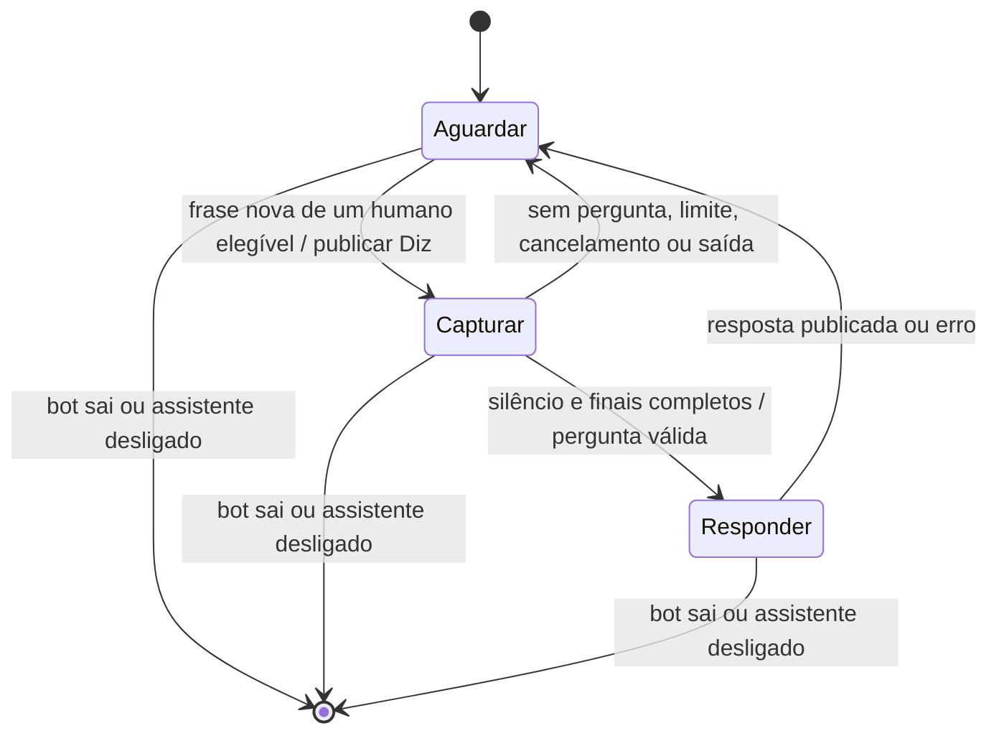

# Plano: assistente por voz «Hey Bot»

Data: 2026-10-03. Estado: chat e voz local implementados; ensaio Discord pendente.

## Experiência pretendida

Enquanto o bot estiver no canal de voz, procura continuamente a frase configurada.
Um utilizador diz «Hey Bot», recebe «Diz», faz uma pergunta e recebe uma resposta.
Depois o bot volta a procurar a frase. Cada ativação corresponde a uma interação.
Não há um temporizador que desligue esta escuta durante a chamada.

Exemplo da primeira versão:

1. Ana: «Hey Bot».
2. Bot, no canal de texto configurado: «@Ana, Diz».
3. Ana: «Explica-me o que é polimorfismo com um exemplo».
4. Bot, no mesmo canal: pergunta reconhecida e resposta curta em português.
5. O próximo pedido exige novamente «Hey Bot».

«Diz» e a resposta são escritos no chat e falados com TTS local em PT-PT.
Também aceitar «Hey Bot, explica…» sem
obrigar o utilizador a esperar pela confirmação.

## Decisões assumidas depois do grilling

O utilizador autorizou fechar as decisões restantes por julgamento do agente.
Estes valores são defaults propostos, ajustáveis depois de um ensaio real.

| Decisão | Escolha e motivo |
| --- | --- |
| Disponibilidade | Ativo por defeito quando o bot está numa chamada; mantém-se até sair ou ser desligado por comando. |
| Âmbito da configuração | Por servidor, persistida; reaproveitar as settings existentes. |
| Quem configura | Permissão Manage Server, como `/streaming`. |
| Quem pode perguntar | Humanos presentes no canal de voz do bot, com Realtime disponível. Ignorar bots. |
| Proprietário do pedido | Só a pessoa que disse a frase pode fornecer a pergunta. As outras vozes não entram no pedido. |
| Concorrência | Uma interação ativa por chamada. Outra ativação recebe indicação de ocupado, sem fila de áudio antigo. |
| Repetição | Repetir a frase durante a captura não cria outro pedido. Durante a resposta, não interrompe o LLM nesta versão. |
| Frase | Default «Olá macaco»; 2 a 5 palavras, até 50 caracteres, normalizada por maiúsculas, acentos e pontuação. Validar que sobra uma frase útil. |
| Deteção | Qualquer posição do enunciado, na ordem certa; ignorar acentos/pontuação/caixa, tolerar um erro de reconhecimento, duas palavras intercaladas e palavras juntas/separadas. Aceitar fronteira entre finais do mesmo autor. |
| Fim da pergunta | Silêncio contínuo do autor, configurado por `ASSISTANT_SILENCE_SECONDS` (default 5; 0,5–20 segundos). Fala nova do autor reinicia o contador; outras vozes e chegada de texto não o reiniciam. Aguardar os finais pendentes antes de enviar uma única pergunta ao LLM. |
| Sem pergunta | 10 segundos após receber a ativação para começar; avisar e voltar à espera. |
| Pedido longo | Máximo de 30 segundos de captura após receber a ativação; se exceder, pedir uma pergunta mais curta, sem responder a um corte arbitrário. |
| Cancelamento | «Cancela» como enunciado isolado do autor durante a captura cancela. Sair do canal também cancela. |
| Resposta | Assistente geral, português por defeito, resposta concisa; sem executar ações, pesquisar a internet ou carregar todo o histórico do servidor. |
| Erros | Timeout de pedido ao LLM de 30 segundos; indicar falha e voltar à espera. Sem repetir automaticamente uma resposta que possa já ter sido publicada. |
| Alterar configuração | Aplicar atomicamente; cancelar captura pendente se mudar a frase, canal ou estado. |
| Reinício | Voltar à espera com eventos novos; nunca ativar por transcrições antigas. |

Os limites de captura e resposta não desligam a escuta contínua. Apenas encerram
uma interação e libertam o bot para a próxima ativação.

## Base existente e impedimentos reais

- `discord_bot/streaming.go` já envia PCM por utilizador à API Python através de
  WebSocket, com um leitor de mensagens de controlo no sentido inverso.
- `src/transcription-api/app/realtime.py` recebe finais Speechmatics com tempos de
  início/fim e persiste-os. Os finais ainda não são enviados ao Go pelo WebSocket.
- `discord_bot/said_keywords.go` procura palavras em qualquer ordem no transcript
  inteiro, consultado cada segundo. Deduplica uma vez por gravação. Esse mecanismo
  não suporta várias perguntas na mesma gravação nem delimita o texto posterior
  à frase. Preservar o trigger existente; criar lógica própria para o assistente.
- `/oracle` e `app/llm.py` já têm transporte LLM e respostas no chat. O oracle exige
  contexto do servidor: não serve diretamente para perguntas gerais sem histórico.
- `src/data/repository.py` já persiste preferências de transcrição por servidor.
- `discord_bot/music.go` envia áudio ao Discord e partilha a saída com o TTS local
  por frames de música e por resposta completa de voz, sem intercalar streams.

**Capacidade é condição de aceitação:** o pool atual reserva duas pessoas por chave
distinta e passa as restantes para Batch. Batch pode esperar 10 segundos de silêncio
ou até 300 segundos de gravação, mais a transcrição. Não serve para este assistente.

O protótipo pode usar os participantes com vaga Realtime, mas a experiência para
todos só está concluída quando houver capacidade para todos os participantes do
cenário alvo. Não aumentar limites no código supondo que o fornecedor os permite.
Antes de desenvolver, medir a chamada alvo e confirmar capacidade disponível. Se
for insuficiente, ampliar capacidade autorizada do fornecedor; caso isso não seja
viável, abrir uma decisão de arquitetura para deteção local/transcrição alternativa.

Status e avisos de transição devem identificar quem não está coberto, sem spam.
Uma pessoa em Batch não deve receber uma ativação atrasada a partir do histórico.
A escuta contínua com transcrição remota também implica uso contínuo do serviço;
medir minutos consumidos no ensaio, sem assumir preços ou saldo.

## Fluxo técnico mínimo



1. Encaminhar finais confirmados pela ligação WebSocket existente, incluindo sessão,
   utilizador, gravação, geração, identidade estável do segmento e tempos de áudio.
   Persistir primeiro; comunicar explicitamente falhas de entrega/stream.
2. No Go, consumir estes eventos sem consultar repetidamente o transcript completo.
   Manter uma janela limitada do enunciado atual e o pedido ativo, com
   deduplicação limitada ao ciclo de vida da ligação/gravação.
3. Detetar a frase com tolerância limitada, incluindo quando se divide entre finais.
   Eliminar apenas a ativação; preservar a pergunta antes e depois no mesmo enunciado.
   Uma pausa superior ao silêncio configurado separa o contexto anterior.
   Associar cada ativação à sua posição no áudio, não apenas ao recording ID.
4. Capturar eventos novos apenas do autor. Associar atividade de fala e progresso
   de finais ao mesmo relógio de áudio. Tratar silêncio/DTX com o PCM e mecanismos
   existentes; validar no ensaio se é necessário um detetor adicional de silêncio.
5. Não fechar a pergunta enquanto houver fala posterior ainda por finalizar. Se
   não for possível obter finais dentro de um prazo limitado, falhar explicitamente
   e regressar à espera, em vez de responder a texto incompleto.
6. Executar o LLM fora do ciclo de receção de áudio. Usar o transporte e limpeza de
   respostas existentes com um método para uma pergunta geral, sem exigir oracle.
7. Publicar uma resposta dirigida ao autor, com a pergunta reconhecida para facilitar
   correções. Respeitar limites de mensagem do Discord pelos helpers existentes.

Falha Realtime cancela a captura afetada e informa indisponibilidade; a gravação
Batch existente pode continuar para as suas finalidades, mas não ativa o assistente.
Eventos repetidos, de gerações obsoletas, recuperados por Batch ou posteriores ao
fecho não podem produzir uma segunda resposta. Desligar o assistente invalida também
a publicação de uma resposta LLM que termine depois desse desligamento.

## Comandos propostos

```text
/assistant status
/assistant phrase value:"Hey Bot"
/assistant channel value:#bot
/assistant enable
/assistant disable
```

`status` mostra frase, estado, destino e cobertura Realtime. Os comandos de alteração
exigem Manage Server. Confirmar persistência antes de confirmar sucesso ao utilizador.
Reutilizar o destino atual de resumo como default; se não houver destino válido,
indicar a configuração em falta e não iniciar pedidos que não possam ter resposta.
Não incluir uma opção de voz que ainda não esteja implementada.

## Ordem de implementação e critérios de saída

### 1. Provar receção e capacidade numa chamada real

Medir o tempo entre falar a frase e receber o final, verificar a cobertura dos
participantes e testar ativação depois de longos períodos em silêncio. Confirmar
que a primeira palavra não se perde ao abrir/reabrir streams. Registar latência e
consumo. Resolver a capacidade do cenário alvo antes de declarar suporte para todos.

### 2. Configuração e entrega de eventos

Adicionar settings e comandos; encaminhar finais no WebSocket e validar identidade,
ordem, geração e tempos. Preservar transcrição, Batch, resumos e trigger «pijama».
Critério: frase/canal sobrevivem a reinício e eventos antigos não ativam pedidos.

### 3. Ativação e captura de uma pergunta

Implementar a máquina de estados por chamada, confirmação «Diz», recorte da pergunta,
silêncio, limites, cancelamento e propriedade por autor.
Critério: várias ativações na mesma gravação funcionam, cada uma com a sua pergunta.

### 4. Resposta no chat

Adicionar a pergunta geral ao contrato LLM e à API existente; integrar no bot com
timeout e retorno ao estado de espera. Atualizar documentação e executar os checks
relevantes de Go/Python e os testes de integração da persistência alterada.
Critério: funciona num servidor sem histórico e não executa comandos por voz.

### 5. Validação de aceitação

Cobrir com testes determinísticos os limites de frase/segmento, pergunta na mesma
frase, duas ativações na mesma gravação, vozes sobrepostas, silêncio, cancelamento,
timeout, mudança de configuração, deduplicação, recuperação Batch e finais atrasados.
Fazer ensaio Discord com dois humanos e música, saída/reentrada e falha de streaming.

Metas iniciais para medir, não garantias: «Diz» até 2 segundos após terminar a frase;
resposta até 10 segundos após terminar uma pergunta curta. Medir percentil 95 em
pelo menos 20 interações, contabilizando também ativações falhadas ou falsas. Se os
finais não permitirem a primeira meta, investigar parciais apenas para ativação;
manter captura e resposta fundamentadas em finais. Nunca ocultar a latência mudando
o início da medição para a chegada da transcrição.

### 6. Voz, depois de validar o chat

Implementada a confirmação «Diz» e a resposta com TTS local em português de Portugal.
Reutiliza o encoder/output Discord e suspende frames de música durante a voz, sem
perder a posição nem alterar pausas manuais. Ignora áudio de bots na deteção e
conserva a resposta no chat se TTS falhar. A saída é chat e voz por defeito, ou só
chat com `ASSISTANT_VOICE_ENABLED=false`. A comparação com voz remota e a escolha
por servidor ficam para uma necessidade posterior.

## Fora desta implementação

Conversa contínua, memória de diálogo, ações/comandos por voz, pesquisa web,
barge-in durante a resposta, filas de pedidos, wake word com modelo local e suporte
a vários processos de API. Reabrir essas decisões só quando houver necessidade
demonstrada; não criar infraestrutura antecipada para elas.


## Estado da implementação (2026-10-03)

Implementadas as etapas de configuração, entrega de finais, ativação/captura e
resposta no chat. `/assistant` persiste as settings por servidor e invalida pedidos
em curso. O transporte existente entrega apenas finais novos e confirmados com
identidade, geração e tempos; Batch não ativa o assistente. O Go mantém uma interação
por chamada e usa atividade PCM, silêncio/DTX e progresso dos finais para fechar
pedidos. Há logs de latência até à publicação e cobertura por participante.

Verificação local: testes Go com race detector; testes Python, incluindo Postgres
isolado por schema e fornecedor WebSocket simulado. O teste Python
`test_final_context_budget_includes_all_prompt_and_memory` já falha no código anterior
por orçamento insuficiente para o prompt oracle; não pertence ao assistente.

A etapa 1 e o ensaio da etapa 5 **não foram realizados**: não há nesta execução uma
chamada Discord controlada com humanos para medir capacidade, p95 e consumo. Não se
alteraram limites do fornecedor nem se declara suporte para todos os participantes.
A preferência `/streaming` existente continua a controlar a disponibilidade Realtime;
usá-la com `mode:on` antes do ensaio. A voz local foi acrescentada a pedido do
utilizador; a avaliação de qualidade, p95 e consumo numa chamada real continua pendente.

A energia PCM usa um limiar inicial RMS de 500 em S16LE, ajustável por
`ASSISTANT_SPEECH_RMS`. Validar o limiar com fala
baixa, ruído, microfones e música; se a heurística não delimitar fala adequadamente,
substituí-la por um detetor comprovado. Pedidos com finais pendentes falham após
5 segundos adicionais ao silêncio configurado, em vez de enviar texto incompleto.
Os parciais ficam ativos no fornecedor e comunicam só os tempos ao bot; nunca
fornecem texto à pergunta. Os seus tempos de áudio ajudam a detetar fala baixa,
mas o instante de chegada do texto não reinicia o silêncio. Números e datas formatados como entidades
também são preservados, incluindo pontuação e resultados com várias palavras.


Atualização da frase: default «Olá macaco», alterável por
`/assistant phrase value:"outra frase"`. A deteção procura a frase em qualquer
posição, ignorando caixa, acentos e pontuação; «ola macaco» e «Olá, Macaco» são
equivalentes. Aceita também «olha macaco», «olá meu macaco», «olamacaco» e pequenos
erros de uma letra. Preserva a pergunta antes/depois, incluindo finais distintos
do mesmo enunciado. A migração atualiza apenas o antigo default persistido e
preserva frases personalizadas.

Correção dos finais: envelopes de tempos sobrepostos, palavras sobrepostas e
marcadores vazios não cancelam a captura. O progresso nunca recua; palavras já
consumidas não voltam à pergunta, mesmo num final cumulativo com outra identidade.
Mantêm-se as validações de geração/autor e de tempos finitos dentro do áudio recebido,
assim como a espera por finais que cubram toda a fala antes de enviar ao LLM.

Voz implementada: `espeak-ng -v pt` sintetiza «Diz» e a resposta, FFmpeg converte
para PCM e o encoder Opus existente envia os frames à chamada. Uma saída exclusiva
impede intercalar frames de música e fala; o decoder da música conserva a posição
e as pausas manuais. Texto permanece no chat em caso de falha e a voz tem limites de
10 segundos para «Diz», 2 minutos para a resposta e 2000 caracteres antes de indicar
o chat para o restante. A desativação, mudança de configuração e saída do autor
cancelam a fala. `ASSISTANT_VOICE_ENABLED=false` permite usar só chat; o default é
chat e voz. Não foi adicionada uma API externa de TTS nem uma escolha por servidor.

Verificação: síntese PT-PT real para pacotes Opus descodificáveis, música bloqueada
durante a fala e retomada depois, preservação de pausa manual, cancelamento dos
processos e fallback de texto em falha de TTS. O ensaio Discord continua pendente.
