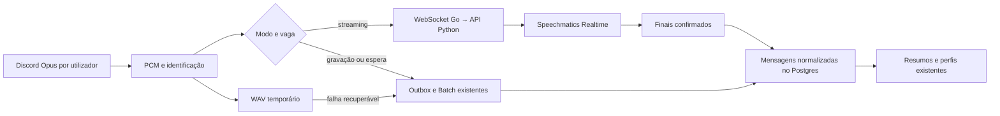

# Plano: transcrição por gravação ou streaming

Data: 2026-10-03. Estado: implementação de código entregue; testes simulados executados; ensaio real por executar.

## Objetivo e decisões

Permitir escolher entre o processamento atual de gravações e transcrição Realtime da
Speechmatics, reutilizando as mensagens, resumos e perfis existentes.

| Tema | Decisão |
| --- | --- |
| Chamadas | Assumir uma única chamada ativa do bot. Não desenvolver coordenação entre chamadas nesta versão. |
| Modo inicial | Definido no `.env`, com streaming desligado por defeito. |
| Comando | `/streaming mode:on\|off\|status`, com permissões de gestão do servidor. A escolha é persistida por servidor e aplica-se à chamada atual. |
| Precedência | Escolha persistida pelo comando; na sua ausência, valor inicial do ambiente. O ambiente não é um bloqueio ao comando. |
| Capacidade | Duas vagas por key distinta. Por instrução do utilizador, assumir que cada key pertence a uma conta diferente; não acrescentar configuração de associação a contas. |
| Atribuição | Ordem de entrada na chamada onde o bot está. Uma vaga pertence ao utilizador até sair, mesmo sem falar. |
| Espera | FIFO da chamada; enquanto espera, o utilizador é gravado e transcrito por Batch. |
| Promoção | Quando uma vaga fica livre, o primeiro utilizador elegível passa de gravação para streaming. |
| Ordem desconhecida | Membros já presentes quando o bot começa a observar, incluindo reinício: desempate pelo ID numérico do Discord. |
| Segurança | Manter áudio temporário também durante streaming; apagar após confirmação durável da transcrição. |
| Créditos | Tentar outra key disponível. Se nenhuma tiver créditos, avisar no Discord, cancelar o áudio pendente afetado e eliminá-lo. Não guardar para retry posterior. |
| Língua | Assumir fala em português de Portugal; API Realtime configurada com `language=pt`. Inglês automático fica fora desta versão. |
| Resultados | Finais alimentam o armazenamento existente; parciais não entram em resumos nem perfis. |
| Logs | Fila, atribuições, promoções e falhas são registadas no terminal, sem avisos automáticos no Discord. |
| Debug | Flag de ambiente, desligada por defeito, permite imprimir texto parcial e final no terminal. |

A exceção aos logs é o aviso de créditos esgotados. As respostas aos comandos continuam
a existir, preferencialmente efémeras; não são publicação de transcrições nem avisos de fila.

A premissa de uma conta por key é uma opção deste projeto, não uma regra da Speechmatics:
o limite Free documentado é por conta. Keys com segredo repetido não aumentam capacidade.
Recusas reais de concorrência devem ser tratadas como falta de vaga e causar fallback
para gravação, sem apagar áudio nem confundir esse erro com créditos esgotados.

## Base atual e pontos de integração

- `discord_bot/audio.go`: entrada/saída, estado da chamada, SSRC, fecho e envio de resumo.
  Regista atualmente ligações por servidor; esta feature assume apenas uma chamada ativa.
- `discord_bot/audio_convert.go`: descodifica Opus para PCM S16LE, 48 kHz, estéreo,
  recupera perdas RTP e escreve WAV. O decoder reutiliza buffers: copiar antes de enfileirar.
- `discord_bot/transcription_client.go`: admissão Batch, outbox durável, retry e barreira
  de finalização de sessão.
- `discord_bot/main.go` e `discord_bot/bot_language.go`: comandos e permissões.
- `src/transcription-api/app/main.py`: admissão de gravações e transformação de segmentos
  em mensagens com timestamps absolutos.
- `src/transcription-api/app/config.py`, `transcriber.py`, `speechmatics_usage.py`:
  configuração, keys e Batch. O consumo medido atualmente não representa saldo real.
- `src/transcription-api/app/workers.py` e `recording_cleanup.py`: recuperação de jobs
  e limpeza de áudio confirmado.
- `src/data/repository.py` e `src/data/migrations/`: persistência, idempotência, readiness
  de resumos e perfis.
- `.env.example`, `docker-compose.yml`, READMEs e requirements: configuração e operação.

Há alterações locais em vários destes ficheiros durante a elaboração do plano. Antes de
implementar, reler o estado atual e integrar sem substituir o trabalho existente.

## Arquitetura proposta



Manter as keys apenas na API Python, como acontece hoje. O Go envia PCM e metadados à
API; o Python gere as ligações Speechmatics e reserva as vagas atomicamente. A versão
inicial usa o processo único de API do deployment atual. Várias réplicas ou processos
Uvicorn exigiriam um coordenador partilhado e ficam fora do âmbito.

O bot controla a ordem dos participantes e a fila da chamada. A API é a autoridade
sobre reservas e estado das keys; o bot só entra em streaming após confirmação.
Se surgir inesperadamente uma segunda chamada, não criar outro pool com a mesma
capacidade: recusar a atribuição Realtime nessa chamada, manter gravação e registar log.
Não alterar nesta feature o comportamento geral de autojoin do bot.

## Configuração e comando

Configuração proposta; os nomes podem ser ajustados às convenções na implementação:

```dotenv
# Valor inicial para servidores sem preferência persistida.
TRANSCRIPTION_STREAMING_ENABLED=false

# Texto transcrito só aparece no terminal quando esta flag é true.
TRANSCRIPTION_STREAMING_DEBUG=false

# Configuração separada dos defaults Batch melia-1/multi.
SPEECHMATICS_REALTIME_URL=wss://eu.rt.speechmatics.com/v2/
SPEECHMATICS_REALTIME_MODEL=enhanced
SPEECHMATICS_REALTIME_LANGUAGE=pt
```

- Guardar a preferência numa tabela de settings por guild, não num ficheiro `.env`
  modificado pelo comando. Persistir antes de confirmar a alteração ao utilizador.
- `status` informa modo efetivo, ocupação e tamanho da fila, sem revelar segredos.
- `on` ordena os membros presentes pela entrada observada, preenche vagas e enfileira
  o excedente. Transcrições Batch já admitidas continuam pelo seu percurso.
- `off` deixa de admitir streams, fecha/flush as existentes e passa a gravação a partir
  de um limite de áudio explícito. Não submeter novamente o áudio já confirmado.
- Com fornecedor diferente de Speechmatics ou sem keys válidas, manter gravação e
  devolver erro explicativo ao comando `on`; não mostrar streaming como efetivamente ativo.
- Debug é configurado por ambiente no processo que recebe os resultados Realtime.
  Logs normais contêm apenas metadados; nunca keys, tokens ou transcrição textual.

## Participação, fila e vagas

1. Registar entradas reais com sequência monotónica antes de operações de rede.
   Updates de mute/deafen e mudanças de SSRC não representam uma nova entrada.
2. Considerar apenas utilizadores humanos presentes no canal atual e elegíveis para
   captura. Bot, utilizadores pausados por `/forget` e membros de outros canais não
   ocupam vaga nem entram na fila.
3. Para o snapshot inicial de membros com chegada desconhecida, ordenar pelo ID
   numérico, usando comparação numérica ou decimal segura, sem conversão para float.
   Inserir novas entradas observadas depois desse grupo, em ordem de evento.
4. Reservar no máximo duas vagas por segredo de key distinto. Escolher entre keys
   saudáveis por menor ocupação, com desempate pela ordem de configuração existente.
5. A vaga é uma reserva de utilizador, independente de um clip WAV ou ligação WS.
   Inatividade não promove outra pessoa. Se o fornecedor fechar uma ligação ociosa,
   reabri-la para o mesmo titular sem aumentar a contagem de reservas.
6. Quem espera usa o pipeline Batch atual. Na promoção, fechar o clip Batch no limite
   da transição, manter o seu outbox e começar uma nova unidade Realtime. Não enviar
   retroativamente para Realtime o áudio já pertencente ao Batch.
7. Ao sair ou mudar para outro canal, fechar a participação, remover da fila, finalizar
   áudio e libertar a vaga uma única vez. Uma reentrada recebe uma nova posição.
8. Ao mover o bot de canal, fechar streams e fila do canal anterior; construir a fila
   do canal novo. Não misturar participantes nem prioridade entre canais.
9. Reinício reconcilia presença real e reconstrói a ordem desconhecida por ID. Áudio de
   segurança sem confirmação segue a recuperação Batch, exceto se estiver descartado
   por falta de créditos ou apagado por `/forget`.

## Transporte e áudio

- Criar cliente Go e endpoint interno WebSocket Python para áudio por utilizador.
  Metadados incluem sessão, Discord ID, participação, stream/epoch e unidade de áudio.
- Negociar formato, receber `RecognitionStarted` e só então enviar áudio ao fornecedor.
  Converter estéreo para mono com soma em precisão suficiente antes da divisão, sem
  overflow. Validar 48 kHz no ensaio técnico; usar resampling explícito se necessário.
- Preservar ordem de silêncio, áudio recuperado e PCM normal. Registar os offsets
  enviados e a correspondência com timestamps absolutos da chamada.
- Usar filas limitadas e workers por stream; a rede não pode bloquear o loop de captura.
  Fila cheia aciona gravação/fallback e log, não crescimento ilimitado de memória.
- Manter heartbeat; fecho envia `EndOfStream`, aguarda finais/`EndOfTranscript` com
  timeout e depois liberta recursos. Em falha, reconciliar áudio sem confirmação.
- Reinícios da ligação criam epochs com offsets próprios. Grandes períodos de silêncio
  podem iniciar nova epoch mantendo a reserva, evitando acumular silêncio em memória.
- Chunks duplicados ou fora de ordem são detetados por sequência. Não reconectar e
  reenviar áudio sem reconciliar resultados anteriores.

## Persistência e fallback sem duplicação

O áudio precisa de uma identidade independente do modo de transcrição. Introduzir
unidades duráveis por utilizador/participação, alinhadas com os clips/limites de transição.
Uma ligação Realtime pode atravessar várias unidades; os timestamps de palavras permitem
associar resultados à unidade correta sem duplicar palavras nos limites.

Migração proposta, a detalhar durante a implementação:

- Settings de streaming por guild.
- Participações/streams com identidade, key por nome, epoch, offsets e estado.
- Unidades de áudio com WAV, intervalo, dono de processamento, versão e estado.
- Segmentos finais com identidade idempotente e origem/unidade associada às mensagens.
- Estado terminal de descarte por créditos, motivo e limpeza pendente.

Estados de trabalho: `recording`, `streaming`, `fallback_pending`, `completed` e
`discarded_no_credits`. Estados e transições devem ser persistidos antes de side effects
irreversíveis. Eventos atrasados usam geração/versão para não reabrir trabalho terminado.

Política proposta:

1. Persistir cada final Realtime de forma idempotente; `AudioAdded` não significa que
   texto foi guardado. Parciais só são usados pelo debug.
2. Uma unidade só fica concluída após fecho do áudio e confirmação de todos os finais
   esperados. Só então é elegível para limpeza normal e atualização de perfis.
3. Em falha recuperável, reter o WAV e encaminhar a unidade incompleta para Batch.
   Os resultados Batch substituem atomicamente as mensagens Realtime da mesma unidade;
   não são acrescentados por cima. Recalcular os chunks afetados nessa transação.
4. Antes de processar fallback, invalidar a geração Realtime dessa unidade. Resultados
   tardios ou repetidos não voltam a inserir mensagens nem vencem o resultado Batch.
5. Perfis/LLM só recebem unidades concluídas ou encerradas definitivamente. Isso evita
   incorporar duas vezes uma unidade cujo texto foi substituído pelo fallback.
6. `/recap` pode usar os finais já guardados, mas o resumo final da chamada aguarda
   streams, flush e jobs admitidos. Timeout com áudio recuperável encaminha para Batch;
   descarte por créditos é terminal e não bloqueia o resumo.
7. Não reenviar unidades concluídas no restart, `/retry`, promoção ou alteração de modo.

## Falhas e falta de créditos

| Situação | Comportamento |
| --- | --- |
| Vagas ocupadas | FIFO e gravação; apenas log. |
| Recusa de concorrência do fornecedor | Tentar outra key com capacidade; caso contrário, gravação e log. Não declarar créditos esgotados. |
| Falha de rede, timeout ou fila de áudio cheia | Fallback durável para Batch, retry com backoff limitado e apenas log. |
| Key inválida ou configuração incompatível | Retirar key do pool utilizável e registar erro; não apagar áudio por esse motivo. |
| Uma key sem créditos | Marcar indisponível para novas transcrições, tentar outra key sem exceder vagas e preservar a ordem/reserva do participante. |
| Todas as contas sem créditos, confirmado pelo fornecedor | Aviso no Discord; descartar áudio pendente afetado e suspender captura de novo áudio para transcrição nessa chamada. |

Não inferir falta de créditos a partir de um percentual do orçamento configurado, de
um erro genérico, de falta de keys, ou de indisponibilidade da consulta de uso. Mapear
respostas concretas do fornecedor no ensaio técnico e cobri-las com testes.

No descarte por créditos:

- Preservar mensagens/texto já confirmados. Encerrar unidades parcialmente confirmadas
  mantendo esse texto, sem aceitar finais tardios do restante áudio.
- Marcar unidades e jobs pendentes afetados como descartados antes de limpar ficheiros;
  invalidar callbacks e impedir workers/replay de continuar o trabalho cancelado.
- Eliminar WAV, buffers, outbox e sidecars desses trabalhos. Tentar cancelar jobs remotos
  se a API o permitir; a impossibilidade de cancelar remotamente não autoriza reinserção.
- Limpeza é idempotente, confinada à pasta de gravações, e é repetida após restart se
  falhar. Falha de unlink não transforma um job descartado em job para transcrever.
- Emitir um aviso por episódio de esgotamento no canal de resumo da chamada. Guardar
  o estado do aviso para evitar spam/repetição após reinício; falha de envio fica nos logs.
- Mensagem sugerida: “Os créditos da Speechmatics esgotaram. A transcrição desta chamada
  foi interrompida e o áudio pendente foi eliminado. O texto já transcrito foi preservado.”
  Enviar depois da limpeza; se houver limpeza pendente, dizer que será eliminado.
- Manter o bot na chamada e as outras funções disponíveis. Uma nova chamada ou comando
  explícito `on` permite reavaliar as keys; não recuperar áudio já descartado.

Esta política também se aplica a gravações Batch da chamada quando todas as contas
Speechmatics estiverem sem créditos. Não introduzir fallback automático para Whisper.

## Logs, debug e apagamento de dados

- Logs estruturados: sessão, utilizador, nome da key, vaga, posição, transição, motivo,
  offset, unidades pendentes e latência. Não repetir um log de fila a cada pacote.
- Debug imprime parciais e finais com sessão/utilizador e tipo de resultado, sem segredos.
  Parciais que mudam não são contados como novas mensagens persistidas.
- Integrar `/forget` na barreira de streams: pausar captura, retirar da fila, invalidar
  gerações, fechar WS, cancelar jobs, limpar áudio e só depois confirmar apagamento.
  Nenhum final tardio ou retry pode recriar dados do utilizador apagado.
- Alargar a recuperação/limpeza existentes para unidades streaming e descartadas, sem
  apagar gravações de outros utilizadores ou trabalho ainda recuperável.
- Contabilizar separadamente uso Realtime e Batch. Vagas reservadas não são horas de
  áudio transcrito; fallback efetivamente enviado pode consumir ambos os produtos.

## Fases de desenvolvimento

### 1. Validar protocolo e fechar contratos técnicos

- Ensaio isolado Realtime com PCM, `enhanced`, `pt`, finais, parciais, heartbeat e flush.
- Confirmar códigos de concorrência, autenticação, créditos e formato de timestamps.
- Fixar contratos Go/API, identificadores, limites de fila e timeouts; criar simulador WS.
- Manter Batch `melia-1/multi` separado. Não utilizar a eventual presença de Melia no
  enum da referência WS como prova de suporte Realtime.

### 2. Configuração, persistência e controlo

- Adicionar settings/envs, migração, endpoint de settings e comando Discord.
- Implementar modo efetivo, persistência por servidor, permissões e `status`.
- Acrescentar rastreio de participação, FIFO e gestor de duas reservas por key distinta.
- Verificar ordenação, saídas, reentradas, mute, snapshots e reinício sem API paga.

### 3. Captura e transporte Realtime

- Separar produção de PCM dos destinos sem alterar recuperação RTP existente.
- Implementar cliente Go, endpoint interno, cliente Speechmatics e filas limitadas.
- Manter WAV de segurança e limites explícitos nas transições Batch/streaming.
- Implementar reserva independente de atividade, heartbeat, epochs e fecho com flush.

### 4. Resultados, fallback e recuperação

- Persistir finais e unidades; reutilizar normalização de mensagens/timestamps.
- Implementar substituição atómica no fallback e impedir inserções de gerações antigas.
- Integrar barreiras de resumo, perfis, `/forget`, restart, outbox e limpeza.
- Garantir que ligar/desligar durante fala não perde áudio nem duplica transcrições.

### 5. Créditos, observabilidade e documentação

- Implementar classificação de erros, tentativa entre keys e descarte terminal.
- Integrar aviso único no Discord e impedir replay de gravações eliminadas.
- Adicionar logs de transição, debug textual e reporte de uso Realtime separado.
- Atualizar `.env.example`, compose, requirements e documentação operacional.

### 6. Verificação final e ativação

- Executar testes relevantes Go/Python e integração em Postgres descartável.
- Verificar numa chamada controlada modo gravação, modo streaming e fila com excesso
  de participantes. Usar testes simulados para créditos e falhas destrutivas.
- Fazer o primeiro ensaio real com uma key e debug ativado; depois testar várias keys.
- Entregar com streaming desligado por defeito. Reverter o modo com `/streaming off`
  ou alterar o valor inicial para instalações sem preferência persistida.

## Critérios de aceitação e testes

- Streaming desligado preserva o percurso atual de gravação, outbox, resumos e perfis.
- `.env` só define o modo inicial; comando autorizado persiste e altera a chamada atual.
- Uma key distinta dá duas vagas; três participantes deixam o terceiro em gravação/FIFO.
  Duas keys distintas permitem quatro titulares; keys duplicadas não aumentam capacidade.
- Silêncio não liberta vaga. Saída promove o primeiro da fila, sem duplicar o Batch anterior.
- Updates de mute, novos SSRC e reconexões não alteram prioridade nem aumentam reservas.
- Reinício/snapshot usa desempate estável por ID; reentrada fica no fim da fila.
- Atribuições concorrentes nunca ultrapassam duas reservas por key; fecho é idempotente.
- PCM mantém ordem, identidade e timestamps através de perdas RTP, silêncio e epochs.
- Rede lenta/fila cheia não bloqueia outros utilizadores nem deixa crescer buffers sem limite.
- Finais repetidos/tardios não duplicam mensagens. Fallback substitui apenas a unidade
  afetada e perfis não absorvem resultados de duas versões da mesma unidade.
- Desligar durante fala, saída, mudança de canal e `/stop` concluem ou recuperam áudio;
  o resumo só corre depois das barreiras necessárias.
- Erro de concorrência/rede não causa eliminação por créditos.
- Créditos esgotados numa key tentam outra; todas esgotadas causam aviso único, descarte
  e limpeza. Restart e `/retry` nunca ressuscitam esse áudio; texto confirmado permanece.
- Falha de limpeza ou envio do aviso é recuperável sem reiniciar transcrição descartada.
- `/forget` elimina dados e impede recriação por eventos ou jobs tardios.
- Não há legendas nem avisos de fila/promoção no Discord. Debug off não imprime transcrição;
  debug on imprime resultados no terminal. Logs nunca incluem credenciais.
- PT-PT é testado com áudio representativo, usando código Speechmatics `pt`.

Comandos de verificação existentes, a executar durante a implementação:

```bash
PYTHONPATH=src:src/transcription-api .venv/bin/pytest -q src/transcription-api/tests
cd discord_bot
go test -race ./...
```

Testes de integração usam `TEST_DATABASE_URL` descartável; Go requer Opus/opusfile.
Testes automatizados devem usar fornecedores simulados, sem créditos ou Discord reais.
Este plano não implica que esses testes ou ensaios tenham sido executados.

## Referências verificadas

- [Limites Realtime: Free, concorrência e encerramento](https://docs.speechmatics.com/speech-to-text/realtime/limits).
- [Quickstart: WebSocket, finais e parciais](https://docs.speechmatics.com/speech-to-text/realtime/quickstart).
- [Áudio Realtime](https://docs.speechmatics.com/speech-to-text/realtime/input).
- [Modelos: Enhanced/Standard Realtime; Melia Batch](https://docs.speechmatics.com/speech-to-text/models).
- [Línguas: português usa código pt](https://docs.speechmatics.com/speech-to-text/languages).
- [Referência WebSocket](https://docs.speechmatics.com/api-ref/realtime-transcription-websocket).
- [Discord Voice State: não inclui timestamp de entrada](https://docs.discord.com/developers/resources/voice#voice-state-object-voice-state-structure).

Plano preparado com a skill `grilling`, após entrevista e confirmação de que as escolhas
restantes ficam ao critério do implementador. Sem alterações ao código nesta tarefa.


## Entrega de implementação — 2026-10-03

Implementado o percurso Go → WebSocket interno → Speechmatics Realtime, com comando
`/streaming mode:on|off|status`, preferência persistida por guild e default desligado.
Foram preservadas as alterações locais anteriores à implementação.

- FIFO por participação, snapshot numérico, entradas observadas antes de operações de
  rede, reservas independentes de atividade, duas vagas por segredo distinto e recusa
  de outra chamada enquanto o pool está ocupado.
- Downmix int32, cópia dos buffers Opus, fila limitada por epoch, sequência explícita,
  heartbeat, negociação e flush com timeout. Transições fecham unidades sem reutilizar
  retroativamente áudio Batch. Uma epoch corresponde a um WAV nesta implementação.
- Migração `006_streaming.sql`, finais idempotentes associados ao WAV, invalidação de
  gerações, substituição atómica pelo Batch, barreiras de resumo/perfis e recuperação
  de headers interrompidos. `/retry` ignora outboxes de WAVs ainda abertos.
- `/forget` pausa/fecha captura e invalida unidades, interrompe polling e tenta cancelar
  jobs remotos antes da eliminação; callbacks tardios não podem recriar dados.
- Créditos confirmados tentam outra key; o descarte de todas as keys é terminal e
  precede limpeza. Avisos pendentes têm episódio persistido e nonce Discord. O nonce
  só cobre alguns minutos no Discord; uma falha prolongada simultânea após envio e
  antes da confirmação persistida pode exigir reconciliação manual do aviso.
- Variáveis no exemplo de ambiente/Compose, uso Realtime separado, debug textual
  opt-in e documentação operacional nas READMEs.

Verificação executada com fornecedores simulados e Postgres 17 descartável, isolado
por schema em cada teste; nenhum crédito Speechmatics ou Discord real foi utilizado:

- Go: `go test -race ./...` e `go vet ./...` passaram, incluindo fronteiras de modo
  com Opus real, downmix, filas, FIFO, reparação WAV e outbox ativo.
- Python: **138 passaram; 1 falhou** na suite completa. Os 15 casos de streaming
  passaram. A falha preexistente é
  `test_review_python.py::test_final_context_budget_includes_all_prompt_and_memory`:
  o prompt oracle excede o orçamento de 4000 caracteres. `llm.py` e esse teste não
  foram alterados por esta implementação.
- Ruff nos ficheiros Python alterados, `git diff --check` e
  `docker compose config --quiet` passaram. A validação Compose usou placeholders
  apenas para os valores Discord obrigatórios. O lint global também identificou
  uma ordenação de import preexistente em `src/data/__init__.py`.

Por executar: chamada controlada com áudio PT-PT e Speechmatics real, primeiro com
uma key/debug ligado e depois várias keys. O software mantém streaming desligado
por defeito; `/streaming mode:off` é o rollback operacional.
