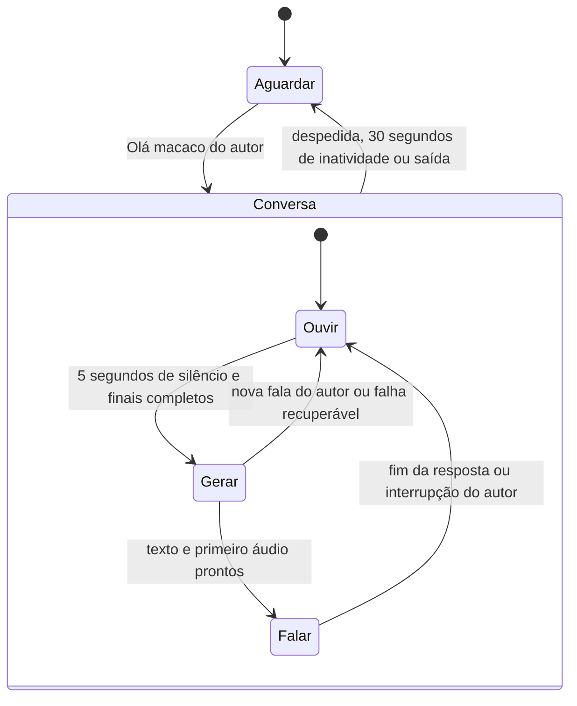

# Plano: conversa contínua com «Olá macaco»

Data: 2026-10-06. Estado: implementação concluída e verificada localmente; ensaio Discord real pendente. Decisões confirmadas pelo utilizador após três rondas de Grilling e confirmação final.

## Objetivo confirmado

«Olá macaco» abre uma conversa natural. O utilizador pode continuar a falar sem
repetir a ativação a cada resposta. O bot recebe contexto dos últimos minutos da
chamada e mantém o fio da conversa. «Adeus macaco» termina a conversa; um período
de inatividade também a termina: 30 segundos disponíveis para o autor responder,
sem contar o tempo de geração e reprodução da resposta do bot.

## Factos do código atual

- `discord_bot/assistant.go` mantém um pedido por chamada e executa `reset()` depois
  de responder. Enquanto responde, descarta novas palavras do autor para o pedido.
- A captura já associa falas a utilizadores, espera silêncio e finais confirmados,
  preserva perguntas entre gravações e cancela operações através de contextos Go.
- A confirmação e a resposta já podem ser publicadas no início da reprodução de
  voz; a síntese já produz áudio por segmentos e conserva a alternativa por texto.
- `/v1/assistant/question` insere perguntas e respostas na persistência existente.
  O contexto atual usa `get_guild_oracle_context`, que reúne mensagens, perfis,
  resumos e bulks de todo o servidor. Não garante a janela da chamada atual.
- `get_session_messages(session_id)` já isola a chamada, identifica autores e ordena
  mensagens; atualmente lê a chamada inteira. Realtime persiste cada final antes
  de o enviar ao bot, pelo que não é necessário esperar pelo fecho de um bulk.
- `format_transcript` já formata nomes, tempos e autoria. Os bulks continuam úteis
  como memória de fundo; são agregados por servidor e processados após o fecho.

## Primeira ronda: decisões confirmadas

O utilizador confirmou estas escolhas através das opções selecionáveis.

| Decisão | Escolha confirmada | Consequência |
| --- | --- | --- |
| Quem conversa | A pessoa que ativou; outras vozes são contexto | As outras pessoas não fornecem turnos à conversa ativa |
| Janela recente | Últimos 5 minutos da chamada atual | Atualizar o contexto a cada turno, além do histórico do diálogo |
| Fim de um turno | 5 segundos de silêncio do autor, aguardando finais | Preservar margem para pausas a meio da frase |
| Inatividade | 30 segundos para o utilizador responder; suspender durante geração e voz do bot | Começar uma nova janela quando a resposta termina |

## Segunda ronda: decisões confirmadas

| Decisão | Escolha confirmada |
| --- | --- |
| Interrupção | Nova fala do autor interrompe geração ou voz; ouvir o novo turno e responder após 5 segundos de pausa |
| Fala lateral | Toda a fala do autor durante a conversa é dirigida ao bot; o autor termina a conversa antes de falar de lado |
| Outra ativação | Manter o autor atual; avisar a outra pessoa que o bot está ocupado |
| Despedida | Aceitar despedida isolada e «obrigado, adeus macaco»; não terminar por uma citação numa pergunta |

## Terceira ronda: decisões confirmadas

| Decisão | Escolha confirmada |
| --- | --- |
| Extensão | 2–4 frases por defeito; desenvolver quando o autor pedir |
| Chat | Mostrar a fala reconhecida do autor e a resposta; publicar a resposta no início da voz |
| Fim explícito | Responder à despedida com uma despedida curta |
| Fim por inatividade | Encerrar silenciosamente após 30 segundos disponíveis para responder |
| Falhas | Aviso curto, manter a conversa até ao timeout e permitir repetir sem nova ativação |
| Duração de um turno | Até 60 segundos de fala/captura; se exceder, pedir para encurtar sem responder a um corte arbitrário |

«Olá macaco» sozinho recebe a confirmação uma vez e abre a janela de 30 segundos
para começar. Uma pergunta incluída na ativação inicia logo o primeiro turno.
A janela de 30 segundos substitui o prazo inicial de 10 segundos da versão anterior.
Conservar o limite validado de 2000 caracteres por fala: exceder duração ou texto
produz um aviso para encurtar, sem enviar apenas parte da pergunta ao LLM.
Fala do autor reinicia a inatividade; cinco segundos de silêncio fecham cada turno.
Outras pessoas, ruído e silêncio artificial não reiniciam os relógios do autor.

## Solução mínima com Ponytail

1. **Distinguir conversa de turno no controlador existente.** A conversa mantém
   o autor, tempos e histórico limitado. O pedido atual continua a delimitar
   uma fala e uma resposta. Concluir um turno limpa apenas o pedido; terminar a
   conversa limpa também o histórico transitório e volta à procura de ativação.
   Manter uma conversa ativa por chamada, sem gestor novo,
   filas de conversas ou sessões concorrentes por utilizador.
2. **Dois relógios separados.** Uma pausa curta fecha o turno para obter uma
   resposta. A pausa longa encerra a conversa. Ruído, silêncio artificial,
   transcrições atrasadas e a voz do bot não podem prolongar a conversa como se
   fossem nova fala do utilizador. Aplicar o limite de 60 segundos de captura por turno e
   conservar o prazo existente de 30 segundos para o LLM separadamente da
   inatividade. Suspender a inatividade durante geração/voz; dar uma nova janela
   de 30 segundos quando termina a resposta ou um aviso recuperável.
3. **Contexto recente e histórico de diálogo separados.** Acrescentar uma query
   pequena com `session_id`, janela temporal e limite de resultados; reaproveitar
   a formatação existente. Atualizar a janela em cada turno. Não esperar pelos
   resumos dos bulks, nem usar memória de outras chamadas como substituto.
   Levar ao LLM os últimos turnos da conversa ativa, com autor e papel claramente
   identificados, sem os destilar como evidência: «e nesse caso?» deve conservar
   a referência à resposta anterior. Aplicar o orçamento existente de `LLM_CONTEXT_CHARS` ao prompt completo.
   Guardar no máximo 12 trocas recentes (24 mensagens), sem cortar a fala atual;
   priorizar o diálogo mais recente e preencher o espaço restante com contexto
   recente da chamada. Se a janela ultrapassar o orçamento, usar a parte mais
   recente e identificar cobertura parcial, sem alegar acesso a toda a conversa.
   Não introduzir uma chamada adicional ao LLM para resumir cada turno.
4. **Reutilizar API e persistência.** Alargar o contrato atual de pergunta para
   transportar o histórico limitado; validar campos e limites na API. Identidade
   e contexto recente continuam associados à chamada existente. Persistir cada
   pergunta/resposta pelo caminho atual. Histórico ativo fica em memória e não
   é reativado após reinício. Sem migração enquanto não existir uma necessidade
   confirmada de recuperar conversas abertas.
5. **Encerramento e interrupções explícitos.** Reconhecer a despedida do autor
   após normalizar acentos, caixa e pontuação; aceitar «adeus macaco» isolado e
   variantes de cortesia como «obrigado, adeus macaco». Uma pergunta que cite a
   expressão não termina a conversa. Só o autor pode terminá-la por fala.
   Encerrar também quando o autor sai, o bot muda de canal ou o assistente é
   desligado. Invalidar operações pendentes e usar os cancelamentos existentes.
   Uma rotação normal de gravação mantém conversa e turno. Enquanto gera ou fala,
   continuar a consumir fala nova do autor: interromper a resposta, conservar a
   nova fala e aguardar cinco segundos de silêncio antes de responder novamente.
   Ignorar outras vozes para interrupção; não tratar picos de ruído como fala.
   Respostas geradas que nunca foram publicadas não entram como respostas do bot
   no histórico. Se o texto já foi publicado e a voz foi cortada, marcar a
   reprodução como interrompida. Preservar a pergunta anterior ainda sem resposta
   entregue, para compreender acrescentos como «e usa Python».
6. **Entrega conversacional e falhas.** Confirmar a abertura uma vez; evitar
   repetir «Diz» entre turnos. Respostas naturais em PT-PT, com 2–4 frases por
   defeito e desenvolvimento a pedido. Mostrar fala reconhecida e resposta no
   chat; preservar o início de voz alinhado com a resposta escrita. A despedida
   explícita recebe uma resposta curta e fixa, sem gerar um novo turno LLM.
   Timeout termina silenciosamente. Falha de reconhecimento/LLM gera um aviso
   curto e volta à escuta na mesma conversa; não responder a texto incompleto.
   Se Realtime cair, manter a conversa até ao timeout e aceitar fala nova após
   recuperação da cobertura; Batch não pode reativar ou alimentar turnos antigos.
   Falha de voz conserva a resposta por texto. Não repetir automaticamente uma
   publicação Discord cujo resultado seja ambíguo, nem produzir avisos em loop.
   As reações espontâneas aguardam toda a conversa ativa, incluindo as pausas.

Reutilizar STT, LLM, Piper, transporte Discord e memória existentes. Sem fornecedor
novo, SDK novo, vector DB, segundo processo de conversação, sumarização por turno
ou classificação adicional de intenção sem uma necessidade confirmada. Só mudar
a arquitetura se medições mostrarem que os componentes atuais impedem a experiência.

## Fluxo aprovado nas rondas

Sem voz disponível, a entrega por texto regressa diretamente à escuta.
Uma nova ativação de outra pessoa mantém a conversa atual e recebe um aviso de
ocupado com a limitação de frequência já existente. Toda a fala do autor conta
como dirigida ao bot, incluindo interjeições claras; não acrescentar um classificador
para conversas laterais. A pessoa termina a conversa antes de falar de lado.

## Sequência de implementação

1. Implementar contexto recente e histórico de diálogo, com isolamento por chamada
   e orçamento do prompt verificáveis.
2. Implementar continuidade entre turnos, despedida e relógio de inatividade no
   controlador; manter as correções de captura e entrega anteriores.
3. Aplicar interrupções, falhas recuperáveis, respostas curtas e mensagens no chat.
4. Executar testes relevantes e validar numa chamada real com duas pessoas,
   pausas, ruído e música. Medir ativação, fecho do turno, primeira voz e fim.

## Critérios de aceitação

- Uma ativação permite pelo menos três trocas seguidas sem repetir a frase.
- Perguntas como «porquê?» e «dá outro exemplo» mantêm a referência ao diálogo.
- O bot usa fala recente da chamada, incluindo finais de um bulk aberto; nomes,
  tempos e autoria são preservados e outra chamada não entra nesse contexto.
- Cinco segundos de silêncio fecham o turno; 30 segundos de inatividade terminam
  a conversa. Geração e voz suspendem a inatividade. Uma fala de até 60 segundos
  pode terminar normalmente; ultrapassar o limite não produz uma resposta parcial.
- «Adeus macaco» e «obrigado, adeus macaco» terminam com despedida curta; uma
  pergunta sobre a expressão não termina a conversa. Timeout termina em silêncio.
- Uma rotação de gravação não termina a conversa nem perde segmentos atrasados.
- Eventos duplicados/antigos e respostas após encerramento não geram novas falas.
- Falha da voz mantém a resposta por texto; cancelamento não publica texto antigo.
- O autor interrompe geração e reprodução; a fala nova e a pergunta anterior
  pertinente são preservadas. Outra pessoa não interrompe nem toma a conversa.
- Uma falha recuperável permite repetir sem nova ativação. Desligar o assistente
  ou sair da chamada cancela imediatamente a conversa e publicações pendentes.
- Histórico e contexto são limitados, sem crescimento proporcional à duração
  total da chamada. Reiniciar regressa à espera de uma nova ativação.

## Limites e verificação operacional

Não criar novas tabelas, fornecedores ou configurações por servidor. Reutilizar
`ASSISTANT_SILENCE_SECONDS=5`; acrescentar apenas controlos de duração no ambiente
para inatividade (30 segundos) e captura (60 segundos), com validação de valores.
O estado transitório recomeça à espera após reinício; as trocas já persistidas
continuam disponíveis à memória existente. A cobertura Realtime continua a depender
das reservas atuais. Contexto de fala ainda não transcrita não estará disponível.

Cancelar a operação local deve impedir entrega obsoleta, mesmo se o cliente LLM
não permitir interromper o trabalho remoto já iniciado. Não prometer que o
cancelamento poupa todos os tokens de uma geração em curso. Medir latência da
primeira voz e consumo numa chamada de teste; não prometer uma resposta total em
cinco segundos, pois esse intervalo é apenas a pausa para fechar o turno.

O ensaio Discord continua necessário: os testes locais não medem eco de microfones,
ruído real, cobertura Realtime dos participantes ou latência dos fornecedores.

## Implementação e verificação — 2026-10-06

- Implementados contexto dos últimos cinco minutos por chamada (máximo 500 finais),
  histórico ativo de 24 mensagens, validação da API e orçamento do prompt completo.
  O diálogo conserva autoria, papéis, perguntas sem resposta entregue e voz interrompida;
  a redução de contexto usa os dados recentes e marca cobertura parcial, sem outro LLM.
- Implementados continuidade, despedida fixa, pausa de cinco segundos, inatividade de
  30 segundos disponíveis e captura até 60 segundos/2000 caracteres. Geração e voz
  suspendem a inatividade. Ruído e finais vazios não iniciam turnos nem renovam a janela.
- Implementadas interrupções por fala reconhecida do autor, recuperação sem ativação,
  espera pelos finais de gravações anteriores e cancelamento imediato ao desligar,
  sair ou mudar de canal. A publicação Discord recebe o contexto cancelável da operação;
  resultados ambíguos não são repetidos. Reações espontâneas aguardam a conversa inteira.
- Acrescentados `ASSISTANT_INACTIVITY_SECONDS` e `ASSISTANT_CAPTURE_SECONDS` ao ambiente
  e Docker Compose, com intervalos válidos de 5–300 segundos. Sem novas dependências,
  migrações ou tabelas. Documentação atualizada em `README.md` e na documentação da API.
- Verificação local: 213 testes da API/Python com PostgreSQL descartável, nove testes
  de síntese, `go test -race ./...`, lint dos ficheiros alterados e validação do Compose.
  O lint global conserva uma falha preexistente de ordenação de imports em
  `src/data/__init__.py`; esse ficheiro não foi alterado.
- Pendente: chamada real com duas pessoas, pausas, ruído e música. Os logs
  `assistant activation`, `assistant turn closed`, `assistant delivery` (`voice_ready`)
  e `assistant response` permitem medir abertura, fecho do turno, entrega no início
  da voz e fim. Medir também consumo em `/keys`; os testes locais não medem latência
  dos fornecedores, eco ou precisão do reconhecimento.
